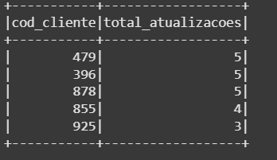
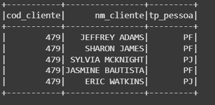

##### Análise de dados

- Top 5 clientes que sofreram atualização na base

  Considerando a coluna cod_cliente como chave única, o resultado foi:

   

  Como ressalva, acredito que por ser um set dump, as informações não estão consistentes e falta uma chave forte como identificação única do cliente

  ```spark.sql(
  SELECT 
  
    cod_cliente,
  
    nm_cliente,
  
    tp_pessoa
  
  FROM clientes
  
  where cod_cliente = 479
  
  LIMIT 5""").show()
  ```

     

  

- Cálculo da média de idade dos clientes considerando dados já deduplicados

  ```
  spark.sql("""
  WITH v_idade AS (
    SELECT 
      cod_cliente, 
      ROUND(datediff(current_date(), dt_nascimento_cliente) / 365.25, 0) AS idade_anos
    FROM clientes_silver
  )
  SELECT Round(avg(idade_anos), 2) AS media_idade
  FROM v_idade
  """).show()
  ```

  Representando uma média de idade de **50.27**


